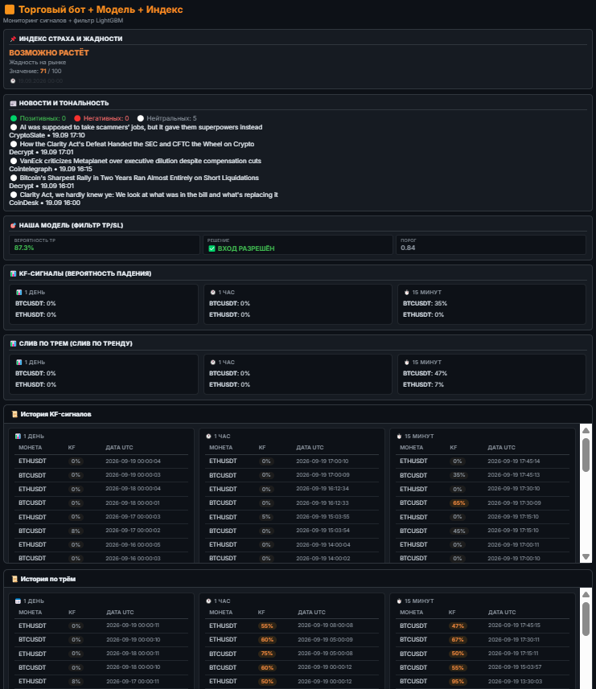
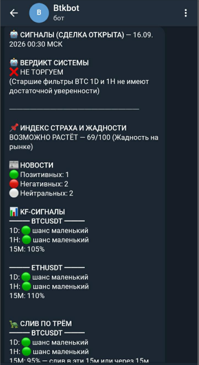
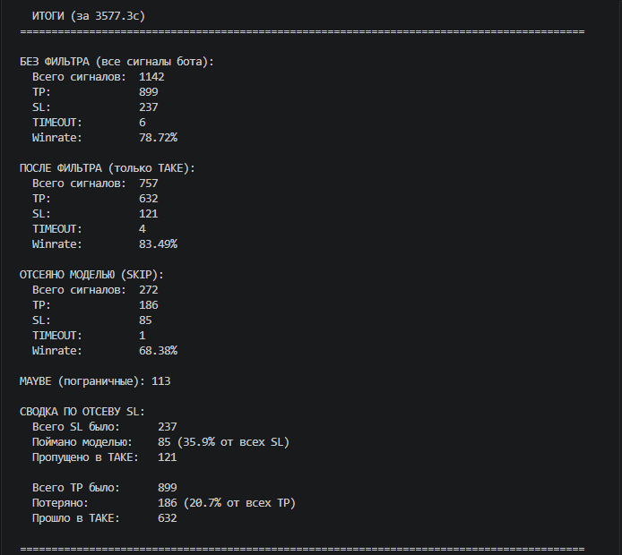

# Botcoin — Trading Bot с ML-фильтром сигналов

Торговый бот для Binance Futures, который снижает количество убыточных
сделок за счёт фильтрации сигналов через модель машинного обучения.

## Как это работает

Система состоит из **трёх слоёв**, каждый решает свою задачу:

```
┌─────────────────────────────────────────────────────────────┐
│ 1. Два KF-бота ищут признаки слива (обвал цены)             │
│    • Бот №1 — BTCUSDT/ETHUSDT на 15m BTC  1h 1d             │
│    • Бот №2 — «слив по трём» (с текстовой интерпретацией)   │
│    Оба анализируют 3 последние свечи:                       │
│    тело, тени, объём, проливы — и выдают коэффициент KF.    │
└─────────────────────────────────────────────────────────────┘
                             │
                             ▼
┌─────────────────────────────────────────────────────────────┐
│ 2. Каскадная логика разрешает вход                          │
│    Сигнал проходит, если совпадают сильные фильтры          │
│    по старшим ТФ (1D, 1H) и подтверждение на 15m.           │
└─────────────────────────────────────────────────────────────┘
                             │
                             ▼
┌─────────────────────────────────────────────────────────────┐
│ 3. ML-модель отсеивает неуверенные сигналы                  │
│    LightGBM, обучен на 1245 исторических сигналах.          │
│    Для каждого сигнала оценивает вероятность TP.            │
│    Если < 0.85 — сделка НЕ открывается.                     │
└─────────────────────────────────────────────────────────────┘
```

## Результаты

Сравнение на исторических данных (walk-forward, без утечки):

| Метрика | Без фильтра | С ML-фильтром |
|---|---|---|
| Сигналов | 1142 | 757 |
| Winrate | 78.7% | **83.5%** |
| Отсеяно SL | — | **35.9%** |
| Потеряно TP | — | 20.7% |
| Expectancy на сделку | +0.091% | **+0.093%** |

Модель не «делает деньги из воздуха» — она **отсеивает сигналы бота,
в которых не уверена**, повышая winrate за счёт сокращения количества
сделок.

## Скриншоты

### Дашборд


### Открытие и закрытие сделки


### Уведомления в Telegram


### Тестирование


## Стек

| Слой | Технологии |
|---|---|
| Backend | PHP 8.2, Laravel 11 |
| ML | Python 3.13, LightGBM, scikit-learn, pandas |
| База | MariaDB 10.4 |
| Инфраструктура | Docker, Docker Compose, Nginx |
| Внешние API | Binance Futures Testnet, Telegram Bot API, RSS (5 источников) |

## Что реализовано

- **Сбор и обработка рыночных данных** — свечи с Binance по 15m / 1h / 1d,
  парсинг, вычисление 45+ производных признаков
- **Два независимых KF-алгоритма** — правила на основе анализа 3 свечей
  (цена, тени, объём, проливы), с кэшированием результатов в БД
  по периодам (15 мин / час / сутки)
- **Обучение ML-модели** — 1245 исторических сигналов, walk-forward
  валидация, финальная модель LightGBM на 200 деревьях
- **Пайплайн вывода** — PHP → Python через `predict_one.py`,
  вероятность TP возвращается в торговый бот
- **Автоматическая торговля** — открытие шорта, установка TP/SL,
  запись сделки в БД, уведомления в Telegram
- **Дашборд** — KF-сигналы, история, новости с sentiment-анализом,
  индекс страха и жадности
- **Упаковка в Docker** — три контейнера (app, nginx, db) с общей сетью,
  воспроизводимый запуск одной командой

## Запуск

```bash
git clone https://github.com/USERNAME/botcoin-laravel.git
cd botcoin-laravel
cp .env.example .env
# указать свои ключи Binance Testnet и Telegram
docker compose up -d --build
docker compose exec app php artisan key:generate
```

Открыть: http://localhost:8000

## Структура

```
app/
  Http/Controllers/DashboardController.php
  Models/                         — Eloquent-модели (Trade, Oth*, OldBotSignal*)
  Services/
    BinanceService.php            — Binance API (цены, свечи, ордера)
    TelegramService.php           — уведомления
    FearGreedService.php          — индекс страха и жадности
    NewsService.php               — RSS + sentiment-анализ
    ModelService.php              — вызов Python ML-модели
    KfBotService.php              — Бот №1 (пишет в oth_*)
    KfCalculatorService.php       — Бот №2 (пишет в old_bot_signals_*)
    TradingBotService.php         — оркестрация: KF → вердикт → ML → сделка
python/
  predict_one.py                  — загрузка модели, расчёт 45 признаков
  tp_filter_model.pkl             — обученная LightGBM
  tp_filter_features.pkl          — порядок признаков
docker/nginx/default.conf
Dockerfile
docker-compose.yml
```

## Ограничения 

- **R:R стратегии 0.42** (TP +0.21%, SL −0.5%) — фундаментальное ограничение прибыльности. Фильтр повышает winrate, но не исправляет соотношение риск/прибыль.
- Модель обучена на 2023–2024 и проверена на 2025-2026. 
- Проект работает с **Binance DEMO**  

## Лицензия

PolyForm Noncommercial 1.0.0 — **запрещено коммерческое использование** без отдельного письменного разрешения.

Для получения коммерческой лицензии свяжитесь: https://github.com/ditlate0-spec

## Автор
IG https://www.instagram.com/prod_23b/ 
[23b] — [ https://github.com/ditlate0-spec / LinkedIn]