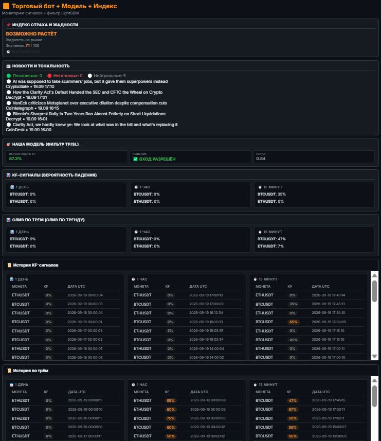
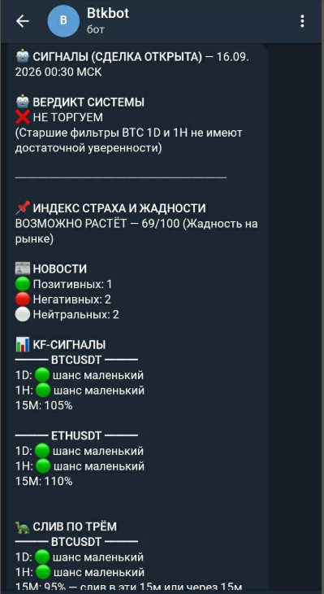
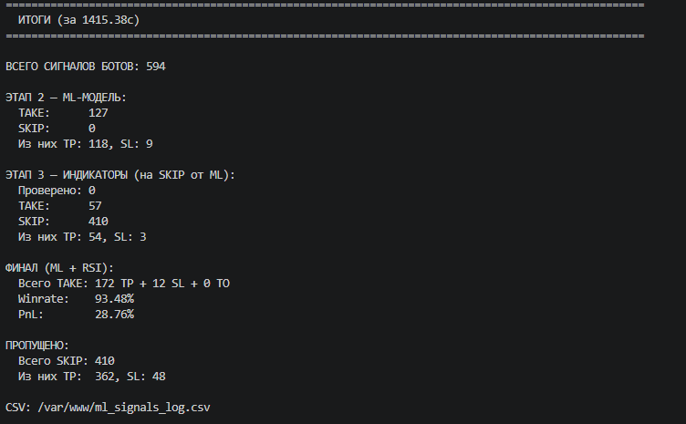

# Botcoin — Trading System с ML-фильтром сигналов

Торговая система для Binance Futures, которая снижает количество убыточных сделок за счёт фильтрации сигналов через ML-модель, индекса страха и жадности и вынесения latency-critical операций в Rust-исполнитель.

## Как это работает

Система состоит из шести слоёв, каждый решает свою задачу.

### Слой 1. Два KF-бота ищут признаки слива (обвал цены)

- **Бот №1** — BTCUSDT/ETHUSDT на 15m / 1h / 1d
- **Бот №2** — «слив по трём» (с текстовой интерпретацией)

Оба анализируют 3 последние свечи: тело, тени, объём, проливы — и выдают коэффициент KF.

### Слой 2. Каскадная логика разрешает вход

Сигнал проходит, если совпадают сильные фильтры по старшим ТФ (1D, 1H) и подтверждение на 15m.

### Слой 3. ML-модель отсеивает неуверенные сигналы

LightGBM, обучена на 1245 исторических сигналах. Для каждого сигнала оценивает вероятность TP. Если < 0.85 — сделка не открывается.

### Слой 4. Фильтр по индексу страха и жадности

Если индекс > 75 («Экстремальная жадность») — торговля блокируется.

### Слой 5. Rust-исполнитель открывает позицию

Latency-critical операции вынесены в отдельный сервис:

- идемпотентность через `idempotency_key`
- автоматический rollback при сбое SL
- защита от наложения позиций
- гарантия отсутствия «голой» позиции без стопа

### Слой 6. AI-агент анализирует сделки

После каждой закрытой сделки система накапливает контекст в журнале `ai_trade_journal`. Раз в сутки LLM-агент анализирует данные и выдаёт отчёт с закономерностями и рекомендациями.

## Архитектура

```
┌───────────────┐   HTTP POST /execute   ┌───────────────────┐
│  PHP/Laravel  │ ─────────────────────► │   Rust executor   │
│   (signals,   │                        │   (axum + tokio)  │
│    verdict,   │ ◄───────────────────── │                   │
│   ML filter)  │  {entry, sl, order_id} │   BinanceClient   │
└───────┬───────┘                        └─────────┬─────────┘
        │                                          │
        │ INSERT INTO trades, ai_trade_journal     │ MARKET SELL
        │                                          │ STOP_MARKET
        ▼                                          ▼
┌───────────────┐                        ┌───────────────────┐
│    MariaDB    │                        │ Binance Futures   │
│   (signals,   │                        │      Testnet      │
│    trades,    │                        │                   │
│ ai_trade_     │                        └───────────────────┘
│   journal)    │
└───────┬───────┘
        │ раз в день (09:00 МСК)
        ▼
┌─────────────────────────────────────────┐
│ AI-агент (Python + LangChain)           │
│ - trades:analyze                        │
│ - POST /analyze → Ollama Cloud          │
│ - storage/app/private/analytics/*.txt   │
└─────────────────────────────────────────┘
```

**Почему Rust:** торговые операции требуют предсказуемой latency, отсутствия гонок данных и гарантий на уровне компилятора.

## Результаты

Сравнение на исторических данных (walk-forward, без утечки):

| Метрика | Без фильтра | С ML-фильтром |
|---|---|---|
| Сигналов | 1142 | 757 |
| Winrate | 78.7% | **83.5%** |
| Отсеяно SL | — | **35.9%** |
| Потеряно TP | — | 20.7% |
| Expectancy на сделку | +0.091% | **+0.093%** |

Модель не «делает деньги из воздуха» — она отсеивает сигналы бота, в которых не уверена, повышая winrate за счёт сокращения количества сделок.

## Управление рисками

### Stop Loss

Фиксированный стоп-лосс **+0.5%** от цены входа (для шорта — выше входа). Выставляется как `STOP_MARKET` с `workingType=MARK_PRICE`.

**Если SL не выставился после открытия позиции — Rust немедленно закрывает позицию.** Голая позиция без стопа невозможна.

### Trailing Stop

Плавающий стоп-лосс:

- **Activation price** = −0.2% от входа
- **Callback rate** = 0.1%

Если trailing не выставился — позиция всё равно защищена фиксированным SL.

### Защита от наложения

Перед открытием Rust проверяет `positionRisk`. Если позиция уже открыта — новая не открывается.

### Идемпотентность

Каждый запрос содержит `idempotency_key`. Rust хранит in-memory HashMap с результатами (TTL 24 часа). Повторный запрос возвращает кэш.

Защищает от:

- Двойного cron-запуска
- Retry при сбое PHP → Rust
- Случайного двойного вызова

## Стек

| Слой | Технологии |
|---|---|
| Backend | PHP 8.2, Laravel 12 |
| Executor | Rust 1.90, axum, tokio, reqwest, serde |
| ML | Python 3.13, LightGBM, scikit-learn, pandas |
| AI-агент | Python 3.13, FastAPI, LangChain, Ollama Cloud (`gpt-oss:120b`) |
| База | MariaDB 10.4 |
| Инфраструктура | Docker, Docker Compose, Nginx |
| Внешние API | Binance Futures Testnet, Telegram Bot API, alternative.me, RSS (5 источников), Ollama Cloud |

## Что реализовано

### Основная логика

- Сбор и обработка рыночных данных (15m / 1h / 1d)
- Два независимых KF-алгоритма
- Каскадный вердикт
- Обучение ML-модели (1245 сигналов, LightGBM)
- Пайплайн вывода PHP → Python
- Фильтр Fear & Greed
- Уведомления в Telegram
- Дашборд: KF, история, новости, AI-анализ

### Rust-исполнитель

- Идемпотентность через `idempotency_key`
- Автоматический rollback при сбое SL
- Защита от наложения
- HMAC-SHA256 подпись
- STOP_MARKET SL + TRAILING_STOP_MARKET
- Fallback `/fapi/v1/algoOrder` → `/fapi/v1/order`
- DRY_RUN режим
- Graceful degradation

### AI-агент анализа сделок

После закрытия каждой сделки система накапливает полный контекст в таблице `ai_trade_journal`. Раз в сутки AI-агент анализирует данные и выдаёт отчёт.

**Как работает:**

1. При **открытии** сделки `telegram_sender.php` пишет в `ai_trade_journal`:
   - 12 KF-коэффициентов
   - ML-вероятность TP и порог
   - Fear & Greed
   - Новости (счётчики + топ-5 + сентимент)
   - Вердикт системы

2. При **закрытии** Rust ловит `user_stream` → `POST /notify/position-closed` → Laravel обновляет: `exit_price`, `exit_time`, `exit_reason`, `pnl`, `fees`, `is_win`, `duration_seconds`.

   PnL и fees считаются сами:
   - `pnl = (entry_price − exit_price) × quantity` (для SHORT)
   - `fees = (entry_price + exit_price) × quantity × 0.0004`

3. **Раз в день в 09:00 МСК** Laravel-команда `trades:analyze`:
   - Берёт закрытые сделки за 24 часа
   - Отправляет в Python-сервис `analyst`
   - Получает анализ от LLM
   - Сохраняет в `storage/app/private/analytics/analysis_*.txt`
   - Показывает на дашборде

**Что анализирует агент:**

- Winrate по новостному сентименту
- Winrate по Fear & Greed
- Winrate по ML-score
- Общее у прибыльных / убыточных
- Проблемы
- Конкретные рекомендации

**Пример рекомендации:**

> «Комиссии (0.076 USDT) составляют почти 38% от чистой прибыли (0.1986 USDT). Сократить размер комиссии: использовать биржу/пару с более низкой taker-fee.»

**Команда:**

```bash
docker compose exec app php artisan trades:analyze --hours=24 --limit=200
```

**Расписание:**

```php
Schedule::command('trades:analyze --hours=24 --limit=200')
    ->dailyAt('09:00')
    ->timezone('Europe/Moscow');
```

**Ограничение:** для статистически значимых выводов нужно 20–30 сделок.

## Запуск

```bash
git clone https://github.com/ditlate0-spec/botcoin.git
cd botcoin
cp .env.example .env
# указать ключи Binance Testnet и Telegram

# Опционально: для AI-агента
# OLLAMA_API_KEY=ваш_ключ
# OLLAMA_MODEL=gpt-oss:120b
# ANALYST_URL=http://analyst:8001

docker compose up -d --build
docker compose exec app composer install
docker compose exec app php artisan key:generate
docker compose exec app php artisan migrate
```

Открыть: http://localhost:8000

**Важно:** `composer install` и `key:generate` — обязательные шаги.

**AI-агент требует:**

- Ollama Cloud API key — [ollama.com/settings/keys](https://ollama.com/settings/keys)
- Бесплатный тариф даёт ограниченные кредиты, но при одном анализе в день хватит надолго.

## Структура проекта

```
coin/
  RustExecutorClient.php          — HTTP-клиент для Rust executor
  telegram_sender.php             — KF → вердикт → ML → Rust + INSERT в ai_trade_journal
  model_check.php                 — вызов Python ML-модели
  binance_demo.php                — старый Binance-клиент (deprecated)

executor/                         — Rust microservice
  src/
    main.rs                       — точка входа
    cli.rs                        — CLI: balance / price / info / serve / trade
    server.rs                     — axum-сервер
    binance/
      client.rs                   — HTTP-клиент с HMAC-подписью
      models.rs                   — serde-структуры
      sign.rs                     — HMAC-SHA256
    api/routes.rs                 — /health, /execute
    trading/
      execute.rs                  — execute_trade с rollback
      idempotency.rs              — in-memory store ключей
    user_stream.rs                — слушает Binance, ловит закрытие, шлёт webhook

app/                              — Laravel-приложение
  Http/Controllers/DashboardController.php
  Models/AiTradeJournal.php
  Console/Commands/AnalyzeTrades.php
  Services/                       — BinanceService, TelegramService, FearGreedService, NewsService, ModelService, KfBotService, KfCalculatorService, TradingBotService

python/
  predict_one.py                  — загрузка ML-модели
  tp_filter_model.pkl             — обученная LightGBM
  tp_filter_features.pkl          — порядок признаков
  analyst/
    __init__.py
    main.py                       — FastAPI + ChatOpenAI → Ollama Cloud
    prompts.py                    — System + Analysis prompts
    formatter.py                  — format_trades() + calculate_stats()
  Dockerfile.analyst
  requirements.txt

database/migrations/
  *_create_ai_trade_journal_table.php

docker/nginx/default.conf
Dockerfile
docker-compose.yml
```

## API Rust executor

Rust-исполнитель слушает `0.0.0.0:8080` внутри сети `botcoin`. PHP обращается по `http://executor:8080`.

### GET /health

Healthcheck для Docker и мониторинга.

**Response:**

```json
{ "status": "ok" }
```

### POST /execute

Открытие SHORT-позиции с автоматической защитой.

**Что делает Rust:**

1. Проверяет `idempotency_key`
2. Проверяет `positionRisk`
3. Получает цену и правила символа
4. Считает `quantity`
5. Отправляет MARKET SELL
6. Ждёт `FILLED`
7. Выставляет `STOP_MARKET`
8. Rollback при сбое SL
9. Выставляет `TRAILING_STOP_MARKET`
10. Возвращает результат

**Request:**

```json
{
  "symbol": "BTCUSDT",
  "margin": 100,
  "leverage": 1,
  "sl_percent": 0.5,
  "trail_activate_percent": 0.2,
  "trail_callback_rate": 0.1,
  "idempotency_key": "trade_2026-09-23_14:45"
}
```

**Response (успех):**

```json
{
  "status": "ok",
  "result": {
    "status": "opened",
    "symbol": "BTCUSDT",
    "side": "SHORT",
    "entry_price": 86504.8,
    "quantity": 0.0011,
    "leverage": 1,
    "sl_price": 86937.3,
    "trail_activation_price": 86301.4,
    "order_id": 28598973686,
    "sl_order_id": 1000000215053860,
    "idempotency_key": "trade_2026-09-23_14:45"
  }
}
```

**Response (dry-run):**

```json
{
  "status": "ok",
  "result": {
    "status": "dry_run",
    "symbol": "BTCUSDT",
    "side": "SHORT",
    "entry_price": 86556.3,
    "quantity": 0.0011,
    "leverage": 1,
    "sl_price": 86989.1,
    "trail_activation_price": 86383.2,
    "order_id": 0,
    "sl_order_id": 0,
    "idempotency_key": "manual_test_1790125825"
  }
}
```

**Response (ошибка):**

```json
{
  "status": "error",
  "error": "position already open on BTCUSDT: amount=-0.0011 entry=86504.8"
}
```

Возможные ошибки:

- `position already open on ...`
- `notional 45.2 below minNotional 50`
- `SL failed (...), position rolled back`
- `CRITICAL: SL failed AND rollback failed`

HTTP-код всегда 200. Реальный статус — в `status`.

### Идемпотентность

Rust хранит in-memory HashMap с результатами (TTL 24 часа). Повторный запрос возвращает кэш.

Защищает от:

- Двойного cron-запуска
- Retry при сбое PHP → Rust
- Случайного двойного вызова

### Rollback при сбое SL

Если `set_stop_loss` падает — Rust немедленно закрывает позицию через MARKET BUY (`reduceOnly=true`). Голая позиция без стопа невозможна.

## Скриншоты

### Дашборд



### AI-анализ на дашборде


### Открытие и закрытие сделки


### Уведомления в Telegram



### Тестирование



## Known issues

### Binance Testnet: /fapi/v1/algoOrder не поддерживается

С декабря 2025 Binance мигрировал условные ордера на новый эндпоинт. На Testnet он отстаёт — возвращает `-4120`.

**Решение:** в `client.rs` реализован fallback на `/fapi/v1/order`.

### Trailing stop: -4136 closePosition not allowed (RESOLVED)

Binance не разрешает `closePosition=true` для `TRAILING_STOP_MARKET`. Возвращает `-4136`.

**Fix:** заменён `closePosition=true` на `quantity + reduceOnly=true`.

### Testnet: stale positionRisk

Иногда `/fapi/v2/positionRisk` возвращает устаревшие данные.

**Решение:** подождать 1–2 минуты, либо Reset Testnet.

## Ограничения

- R:R стратегии 0.42 (TP +0.21%, SL −0.5%)
- Модель обучена на 2023–2024, проверена на 2025–2026
- Проект работает с Binance Testnet (DEMO)
- AI-агенту нужно 20–30 сделок для значимых выводов

## Лицензия

PolyForm Noncommercial 1.0.0 — запрещено коммерческое использование без письменного разрешения.

Для коммерческой лицензии: https://github.com/ditlate0-spec

## Автор

- Instagram: https://www.instagram.com/prod_23b/
- GitHub: https://github.com/ditlate0-spec